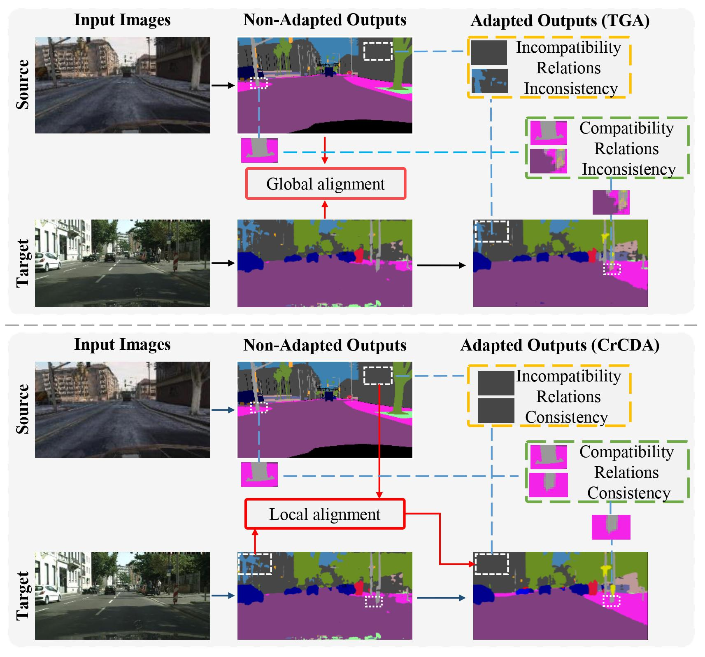

# Contextual-Relation Consistent Domain Adaptation
Jiaxing Huang, Shijian Lu, Dayan Guan, Xiaobing Zhang. "Contextual-Relation Consistent Domain Adaptation for Semantic Segmentation", ECCV 2020
## Updates
- *07/2020*: Accepted to ECCV 2020.
- Code is coming soon. 

## Paper


## Abstract
Recent advances in unsupervised domain adaptation for semantic segmentation have shown great potentials to relieve the demand of expensive per-pixel annotations. However, most existing works address the domain discrepancy by aligning the data distributions of two domains at a global image level whereas the local consistencies are largely neglected. This paper presents an innovative local contextual-relation consistent domain adaptation (CrCDA) technique that aims to achieve local-level consistencies during the global-level alignment. The idea is to take a closer look at region-wise feature representations and align them for local-level consistencies. Specifically, CrCDA learns and enforces the prototypical local contextual-relations explicitly in the feature space of a labelled source domain while transferring them to an unlabelled target domain via backpropagation-based adversarial learning. An adaptive entropy max-min adversarial learning scheme is designed to optimally align these hundreds of local contextual-relations across domain without requiring discriminator or extra computation overhead. The proposed CrCDA has been evaluated extensively over two challenging domain adaptive segmentation tasks (e.g., GTA5 to Cityscapes and SYNTHIA to Cityscapes), and experiments demonstrate its superior segmentation performance as compared with state-of-the-art methods.


## Preparation

### Pre-requisites
* Python 3.7
* Pytorch >= 0.4.1
* CUDA 9.0 or higher

### Installation
Code is coming soon.

### Datasets
In default, you are supposed to work in CrCDA-master folder. The datasets are put in ```CrCDA/data```.

- **GTA5**: - Download [GTA-5](https://download.visinf.tu-darmstadt.de/data/from_games/) dataset. Put dataset in the following structure:
```bash
CrCDA/data/GTA5/                               % Dataset root
CrCDA/data/GTA5/images/                        % Images
CrCDA/data/GTA5/labels/                        % Labels
```

- **Cityscapes**: - Download [Cityscapes](https://www.cityscapes-dataset.com/). Put dataset in the following structure:
```bash
CrCDA/data/Cityscapes/                         % Dataset root
CrCDA/data/Cityscapes/leftImg8bit              % Images
CrCDA/data/Cityscapes/leftImg8bit/val          % Validation images
CrCDA/data/Cityscapes/gtFine                   % Labels
CrCDA/data/Cityscapes/gtFine/val               % Validation Labels
```

### Pre-trained models
Coming soon.

## Running the code
Coming soon.

### Training
Coming soon.

### Testing
Coming soon.
